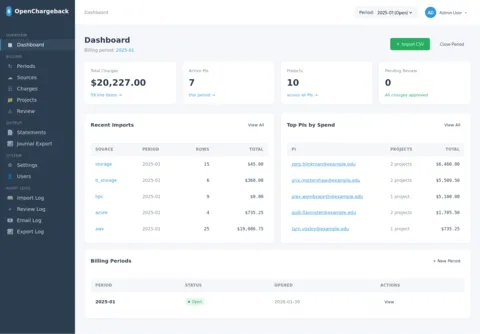
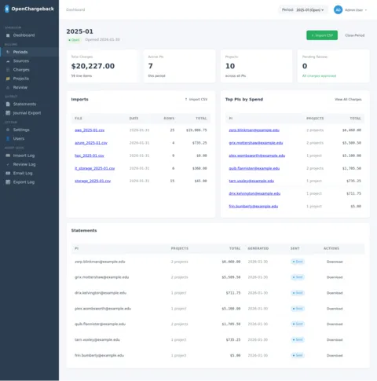
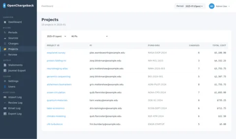
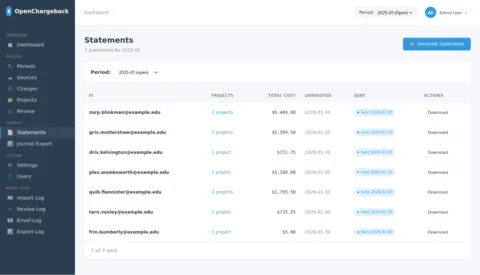
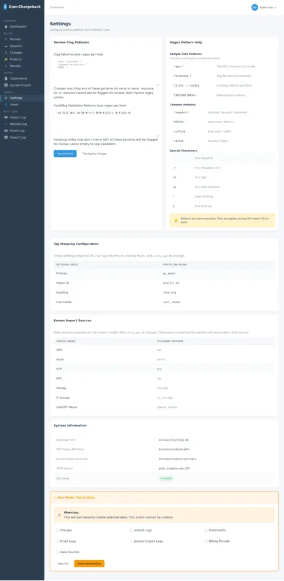

# OpenChargeback

**Simple, transparent billing for research computing.**

OpenChargeback helps research computing groups show PIs exactly what their cloud, HPC, and storage resources cost—even when those costs are partially or fully subsidized.

## The Problem

You run research computing infrastructure—shared HPC, cloud allocations, campus storage. Your PIs use these resources, and someone needs to track usage for grant reporting, chargebacks, or just so researchers understand the true cost of what they're consuming.

Enterprise FinOps tools exist, but they're designed for organizations spending millions per month with dedicated billing teams. You don't need a $50k/year platform. You need something that imports billing data, shows PIs their costs with discount transparency, generates PDF statements, and exports journal entries—without requiring a DBA or enterprise contract.

## How It Works

```
┌─────────────┐     ┌─────────────┐     ┌─────────────┐     ┌─────────────┐
│  AWS/Azure  │     │    HPC      │     │   Storage   │     │   Other     │
│   Export    │     │   Slurm     │     │   Reports   │     │   Sources   │
└──────┬──────┘     └──────┬──────┘     └──────┬──────┘     └──────┬──────┘
       │                   │                   │                   │
       └───────────────────┴───────────────────┴───────────────────┘
                                   │
                                   ▼
                         ┌─────────────────┐
                         │   FOCUS CSV     │
                         │   (Standard     │
                         │    Format)      │
                         └────────┬────────┘
                                  │
                                  ▼
                         ┌─────────────────┐
                         │ OpenChargeback  │
                         │  CLI or Web UI  │
                         └────────┬────────┘
                                  │
                   ┌──────────────┼──────────────┐
                   ▼              ▼              ▼
             ┌──────────┐  ┌──────────┐  ┌──────────┐
             │   PDF    │  │  Email   │  │ Journal  │
             │Statements│  │ Delivery │  │  Export  │
             └──────────┘  └──────────┘  └──────────┘
```

## Screenshots

[](docs/images/Dashboard-OpenChargeback.webp)
[](docs/images/Period-2025-01-OpenChargeback.webp)
[](docs/images/Projects-OpenChargeback.webp)
[](docs/images/Statements-OpenChargeback.webp)
[](docs/images/Settings-OpenChargeback.webp)

## Features

- **Multi-source billing** — Combine AWS, Azure, GCP, HPC, and storage in one view
- **[FOCUS format](https://focus.finops.org/)** — Portable billing data using the FinOps standard
- **Discount transparency** — Show list price, discount, and billed amount
- **Review workflow** — Flag and approve charges before generating statements
- **PDF statements** — Professional documents suitable for grant reporting
- **GL exports** — Template-based journal entries with debit/credit pairing, regex fund parsing
- **Web interface** — Dashboard, charge browser, drag-drop CSV import, dark mode
- **CLI tools** — Script everything for automation
- **Right-sized** — SQLite, no build step, no external services

## Quick Start

```bash
# Install
python -m venv .venv && source .venv/bin/activate
pip install -e .

# Copy and edit configuration
cp config.example.yaml config.yaml

# Import sample data
openchargeback ingest sample_data/inputs/aws_2025-01.csv -s aws -p 2025-01 -c config.yaml
openchargeback ingest sample_data/inputs/hpc_2025-01.csv -s hpc -p 2025-01 -c config.yaml

# Generate statements (dry run)
openchargeback generate -p 2025-01 -c config.yaml --dry-run

# Or start the web UI
openchargeback serve -c config.yaml
```

Open http://localhost:8000 and log in with credentials from `config.yaml`.

## CLI Automation

The CLI and web interface share the same engine. Anything you can do in the web UI, you can script:

```bash
# Monthly billing cron job
PERIOD=$(date +%Y-%m)
CONFIG=/etc/openchargeback/config.yaml

openchargeback ingest /data/aws_${PERIOD}.csv -s aws -p $PERIOD -c $CONFIG
openchargeback ingest /data/azure_${PERIOD}.csv -s azure -p $PERIOD -c $CONFIG
openchargeback generate -p $PERIOD -c $CONFIG --send
openchargeback export-journal -p $PERIOD -f gl -c $CONFIG
```

Statements go out, journals land in a shared folder for accounting—no web clicks required. Use the web UI for exceptions: reviewing flagged charges, adjusting patterns, one-off resends.

See [sample_data/](sample_data/) for example inputs and outputs, or run `scripts/generate-sample-outputs.sh` to regenerate them.

## Documentation

Full documentation is in [`docs/`](docs/README.md):

| Guide | Description |
|-------|-------------|
| [Getting Started](docs/getting-started/) | Installation, configuration |
| [User Guide](docs/user-guide/) | CLI commands, web UI, FOCUS format |
| [Admin Guide](docs/admin-guide/) | Billing workflows, review process, templates |
| [Integrations](docs/integrations/) | Azure, AWS, HPC/Slurm, storage export guides |
| [Operations](docs/operations/) | Database, logging, Docker deployment |
| [Security](docs/security/) | Authentication, audit trail, data protection |

Additional resources:
- [Executive Summary](docs/EXECSUMMARY.md) — Overview for leadership and finance
- [Technology Stack](docs/TECHNOLOGY.md) — Architecture and dependencies
- [Tag Specification](docs/integrations/TAG-SPECIFICATION.md) — Required cloud resource tags
- [SBOM](sbom.json) — Software Bill of Materials (CycloneDX 1.6)

## Development

```bash
pip install -e ".[dev]"
pytest                    # 239 tests
mypy src/                 # Type checking
ruff check src/           # Linting
```

See [docs/development/](docs/development/) for architecture and contributing guidelines.

## License

MIT

## Contributing

Issues and PRs welcome at [github.com/atmarx/OpenChargeback](https://github.com/atmarx/OpenChargeback).

If you've written an [integration guide](docs/integrations/TEMPLATE.md) for a data source we don't cover, we'd love to include it.

---

<sub>Built with [Claude Code](https://claude.ai/code) — the "we" in this README is one human and one AI, pair programming our way through research computing's billing problem.</sub>
